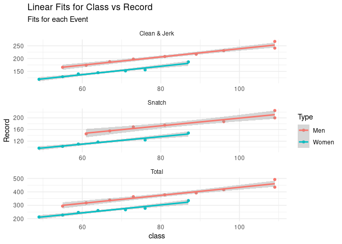

Week 1 Homework
================

## Reading and Cleaning Data

After downloading the data from Wikipedia, I did some cleaning to get it
in the proper format.

``` r
library(tidyverse)

raw_data <- read_csv(here::here("Week_1", "hw_1_data.csv")) |>
  select(-9)

clean_df <- function(raw_df) {

  clean_df <- raw_df |>
    mutate(class = case_when(str_detect(Event, "kg") ~ Event, TRUE ~ NA_character_)) |>
    fill(class, .direction = "down") |>
    drop_na() |>
    mutate(Record = str_extract(Record, "[0-9]+") |> as.numeric(),
           class = str_extract(class, "[0-9]+") |> as.numeric())

  clean_df

}

cleaned_data <- raw_data |> clean_df()
```

Let’s see what the fits look like:

``` r
cleaned_data |>
  ggplot(aes(class, Record, col = Type)) + geom_point() + geom_smooth(method = "lm") + facet_wrap(Event ~ ., scales = "free", ncol =1)
```

    `geom_smooth()` using formula 'y ~ x'



Let’s do some estimates, one linear model for each sex and event
combination:

``` r
nested_mods <- cleaned_data |>
  mutate(Record = str_extract(Record, "[0-9]+") |> as.numeric(),
         class = str_extract(class, "[0-9]+") |> as.numeric()) |>
  group_nest(Type, Event) |>
  mutate(mod = map(data, ~ lm(log10(Record) ~ log10(class), data = .) |> broom::tidy())) |>
  select(-data) |>
  unnest(mod)

coeffs <- nested_mods |>
  select(Type:estimate) |>
  pivot_wider(names_from = "term", values_from = "estimate") |>
  rename(c = 3, beta = 4) |>
  mutate(c = 10^c)

coeffs |>
  knitr::kable()
```

| Type  | Event        |         c |      beta |
|:------|:-------------|----------:|----------:|
| Men   | Clean & Jerk | 13.964334 | 0.6160483 |
| Men   | Snatch       | 11.514833 | 0.6189484 |
| Men   | Total        | 23.485806 | 0.6331054 |
| Women | Clean & Jerk |  7.253371 | 0.7190261 |
| Women | Snatch       |  5.913277 | 0.7141872 |
| Women | Total        | 12.470426 | 0.7270323 |

``` r
cleaned_data |>
  left_join(coeffs) |>
  mutate(pred = c*class^beta) |>
  mutate(normalized_record = 100*(Record/((c*class^beta) - 1))) |>
  arrange(desc(normalized_record)) |>
  head() |>
  select(Type, Event, Athlete, normalized_record) |> 
  knitr::kable()
```

    Joining, by = c("Type", "Event")

| Type  | Event        | Athlete          | normalized_record |
|:------|:-------------|:-----------------|------------------:|
| Men   | Total        | Lasha Talakhadze |          107.6970 |
| Men   | Snatch       | Lasha Talakhadze |          107.6305 |
| Men   | Clean & Jerk | Lasha Talakhadze |          106.6767 |
| Women | Total        | Li Wenwen        |          104.8159 |
| Women | Clean & Jerk | Li Wenwen        |          104.5098 |
| Women | Snatch       | Li Wenwen        |          103.8221 |
