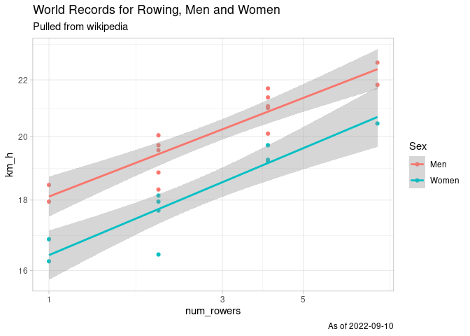
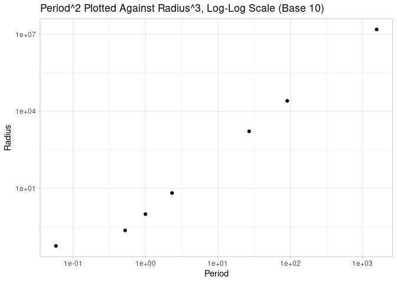

Week 2 Homework
================

# Rowing Records by Weight

Our goal is to verify if this relationship still holds:


## Clean Data

Data is from a wikipedia entry: [List of World Best Times in
Rowing](https://en.wikipedia.org/wiki/List_of_world_best_times_in_rowing)

Let’s import and clean the data

``` r
library(tidyverse)
library(lubridate)

week <- "Week_2"
raw_data <- read_csv(here::here(week, "Data",  "rowing_records_2022.csv"))

clean_data <- raw_data |> 
  mutate(Boat = tolower(Boat)) |> 
  mutate(num_rowers = case_when(  # recoding the boat as number of rowers
    str_detect(Boat, "single") ~ 1,
    str_detect(Boat, "pairs|double") ~ 2,
    str_detect(Boat, "four|quad") ~ 4,
    str_detect(Boat, "eight") ~ 8)) |> 
  mutate(time_min = as.numeric(seconds(Time)/3600)) |> 
      mutate(km_h = 2*60/time_min) # let's use the same units 
                                        # as the plot in the assignment
```

## Visualize Relationships

Let’s see what rowers plotted against time looks like on a log-log plot.

``` r
clean_data |> 
  ggplot(aes(num_rowers, km_h, col = Sex)) + geom_point() + geom_smooth(method = "lm") + 
  scale_x_log10() + scale_y_log10() + theme_light() + 
  labs(title = "World Records for Rowing, Men and Women", subtitle = "Pulled from wikipedia", caption = paste0("As of ", Sys.Date()))
```



## Model

Let’s fit a linear model on the log-log data:

``` r
models <- clean_data |> 
  group_nest(Sex) |> 
  mutate(coeffs = map(data, ~ lm(log10(km_h) ~ log10(num_rowers), .) |> broom::tidy())) |> 
  ungroup() |> 
  select(Sex, coeffs) |> 
  unnest(coeffs)
```

## Explore Model Results

``` r
models |>
  select(Sex:estimate) |>
  pivot_wider(names_from = "term", values_from = "estimate") |>
  rename(c = 2, beta = 3) |>
  mutate(c = 10^c) |> ## we need to exponentiate because the coefficient from the model is on the log scale
  knitr::kable()
```

| Sex   |        c |      beta |
|:------|---------:|----------:|
| Men   | 18.10698 | 0.1021888 |
| Women | 16.42125 | 0.1108222 |

## Interpretation

``` r
mod_clean <- models |>
  select(Sex:estimate) |>
  pivot_wider(names_from = "term", values_from = "estimate") |>
  rename(c = 2, beta = 3) |>
  mutate(c = 10^c) 

coeff_sex <- mod_clean |> 
  pull(beta, Sex)
```

This gives us beta coeff of 0.1021888 for men and 0.1108222 for women.
This is fairly close to 1/9 (0.1111111).

# Orbit of Planets

Data is from a website:
[windows2universe](https://www.windows2universe.org/our_solar_system/planets_orbits_table.html).

From this plot they seem pretty linear on the log-log scale (after
Period is squared and Radius is cubed).

``` r
raw_planet_data <- read_csv(here::here(week, "Data", "planet_orbit.csv")) |> 
  mutate(Period = Period^2, Radius = Radius^3) 

raw_planet_data |> 
  ggplot(aes(Period, Radius)) + geom_point() + scale_x_log10() + scale_y_log10() +
  labs(title = "Period^2 Plotted Against Radius^3, Log-Log Scale (Base 10)") +
  theme_light()
```



``` r
lm(log10(Period) ~ log10(Radius), data = raw_planet_data)
```


    Call:
    lm(formula = log10(Period) ~ log10(Radius), data = raw_planet_data)

    Coefficients:
      (Intercept)  log10(Radius)  
          -0.1738         0.4830  

This would be the exponent in the original form, where


Since 2/3 = \~.667, .48 is relatively close and might be closer if you
remove the outlier on the far left of the plot (Mercury).
