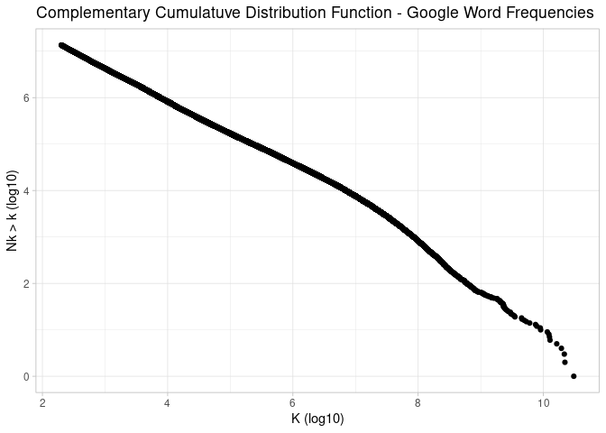
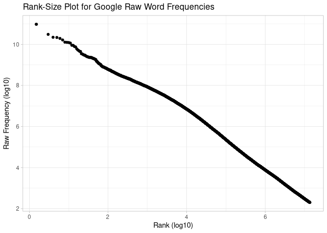
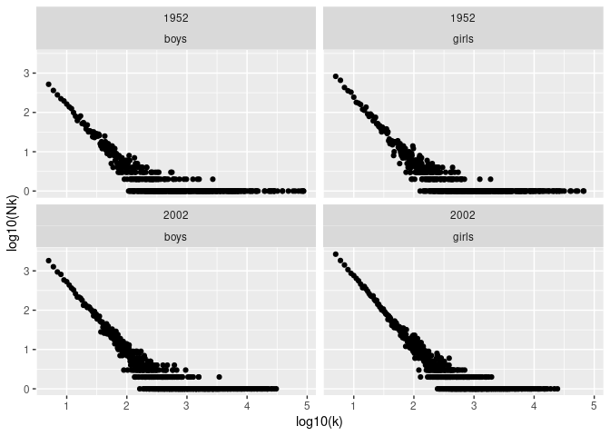

Week 4 Homework
================

## CCDF Exponents

``` r
library(tidyverse)

google_data_raw <- read_table(here::here("Week_3", "Data", "vocab_cs_mod.txt"),
                              col_names = c("k", "Nk"))

data_cprob <- google_data_raw |> 
  arrange(desc(k)) |> 
  #mutate(total = sum(Nk)) |> 
  # mutate(prob = Nk/total) |> 
  #mutate(c_prob = cumsum(prob)) 
  mutate(c_count = cumsum(Nk)) 

data_cprob |> 
  ggplot(aes(log10(k), log10(c_count))) + geom_point() +
  labs(title = "Complementary Cumulatuve Distribution Function - Google Word Frequencies",
       x = "K (log10)", y = "Nk > k (log10)") +
  theme_light()
```



``` r
ggsave(here::here("Week_4", "Plots", "ccdf_google_word.png"))

lm(log10(c_count) ~ log10(k), data = data_cprob) |> 
  broom::tidy() |>
  select(term, estimate, std.error) |> 
  knitr::kable()
```

| term        |   estimate | std.error |
|:------------|-----------:|----------:|
| (Intercept) |  8.6423975 | 0.0005197 |
| log10(k)    | -0.6809884 | 0.0000974 |

scaling regions

log10(k) 0 -\> 7 7 -\> 9

``` r
data_scaling_regions <- data_cprob |> 
  mutate(region = case_when(log10(k) <= 7 ~ "region_one",
                            log10(k) <= 9 ~ "region_two", 
                            TRUE ~ NA_character_)) |> 
  drop_na()

data_scaling_fits <- data_scaling_regions |> 
  group_nest(region) |> 
  mutate(coeffs = map(data, ~ lm(log10(c_count) ~ log10(k), data = .) |> broom::tidy())) |> 
  select(region, coeffs) |> 
  unnest(coeffs)

data_scaling_fits |> 
  filter(term == "log10(k)") |> 
  mutate(estimate = abs(estimate) - 1) |> 
  mutate(two_sds = std.error*1.96) |> 
  mutate(upper = estimate + two_sds, lower = estimate - two_sds)
```

    # A tibble: 2 × 9
      region     term     estimate std.error stati…¹ p.value two_sds   upper   lower
      <chr>      <chr>       <dbl>     <dbl>   <dbl>   <dbl>   <dbl>   <dbl>   <dbl>
    1 region_one log10(k)  -0.339  0.0000406 -16274.       0 7.96e-5 -0.339  -0.340 
    2 region_two log10(k)   0.0153 0.000918   -1105.       0 1.80e-3  0.0171  0.0135
    # … with abbreviated variable name ¹​statistic

## CCDF Exponents

Plot

``` r
raw_wordfreq <- read_table(here::here("Week_3", "Data", "rawwwordfreqs.txt"),
                              col_names = c("k"))

wordfreq_rank <- raw_wordfreq |> 
  mutate(rank = rank(-k))

wordfreq_rank |> 
  slice_sample(n = 5000, weight_by = 1/rank) |> 
  ggplot(aes(log10(rank), log10(k))) + geom_point() + 
  labs(title = "Rank-Size Plot for Google Raw Word Frequencies",
       x = "Rank (log10)", y = "Raw Frequency (log10)") + 
  theme_light()
```



``` r
ggsave(here::here("Week_4", "Plots", "rank_size_raw_google.png"))
```

Fits

``` r
wordfreq_rank_regions <- wordfreq_rank |> 
    mutate(region = case_when(log10(rank) <= 4 ~ "region_one",
                           TRUE ~ "region_two")) |> 
  drop_na()
  
word_freq_fits <- wordfreq_rank_regions |> 
  group_nest(region) |> 
  mutate(coeffs = map(data, ~ lm(log10(k) ~ log10(rank), data = .) |> broom::tidy())) |> 
  select(region, coeffs) |> 
  unnest(coeffs)

word_freq_fits |> 
  filter(term == "log10(rank)")  |> 
    mutate(two_sds = std.error*1.96) |> 
  mutate(upper = estimate + two_sds, lower = estimate - two_sds)
```

    # A tibble: 2 × 9
      region     term        estimate  std.error stati…¹ p.value two_sds upper lower
      <chr>      <chr>          <dbl>      <dbl>   <dbl>   <dbl>   <dbl> <dbl> <dbl>
    1 region_one log10(rank)    -1.02 0.000805   -1.26e3       0 1.58e-3 -1.02 -1.02
    2 region_two log10(rank)    -1.41 0.00000708 -2.00e5       0 1.39e-5 -1.41 -1.41
    # … with abbreviated variable name ¹​statistic

## Baby Name Frequencies

``` r
library(xtable)

year <- c("1952", "2002")
gender <- c("boys", "girls")

combos <- crossing(year, gender)

raw_data <- combos |> 
  mutate(raw_data = map2(year, gender,  ~ 
                           read_csv(here::here("Week_4", "Data", "data", glue::glue("names-{.y}{.x}.txt")),
                                    col_names = c("name", "gender", "count")) |> 
                           select(-gender))) |> 
  unnest(raw_data) |> 
  group_by(year, gender) |> 
  arrange(desc(count)) |> 
  mutate(rank = row_number())


plot_rank_zipf <- function(df) {
  
  year <- df$year[[1]]
  gender <- df$gender[[1]]
  
  
  df |> 
    ggplot(aes(log10(rank), log10(count))) + geom_point() + 
    labs(title = glue::glue("Size Rank: {year} for {gender}",
                            x = "Rank (log10)", y = "Size (log10)")) +
    theme_light()
  
  ggsave(here::here("Week_4", "Plots", glue::glue("{gender}_{year}_size_rank.png")))
  
  df |> 
    mutate(rank  = log10(rank), count = log10(count)) |> 
    mutate(region = case_when(rank < 1.5 ~ "Region One",
                              TRUE ~ "Region Two")) |> 
    drop_na() |> 
    group_nest(region) |> 
    mutate(coeffs = map(data, ~ lm(count ~ rank, data = .) |> 
      broom::tidy() ))|>
    select(-data) |> 
    unnest(coeffs) |> 
   filter(term == "rank")   |> 
   mutate(year = year, gender = gender) |> 
      mutate(two_sds = std.error*1.96) |> 
    mutate(estimate = abs(estimate)) |> 
  mutate(upper = estimate + two_sds, lower = estimate - two_sds) 
  
}

plot_ccdf <- function(df) {
  
  year <- df$year[[1]]
  gender <- df$gender[[1]]
  
  
 ccdf_data <- df |> 
    count(count) |> 
    rename(k = count, Nk = n) |> 
    arrange(desc(k)) |> 
    mutate(csum_nk = cumsum(Nk)) 
 
 ccdf_data |> 
    ggplot(aes(log10(k), log10(csum_nk))) + geom_point() + 
    labs(title = glue::glue("CCDF: {year} for {gender}"),
                            x = "k (log10)", y = "Freq > K (log10)") +
    theme_light()
  
  ggsave(here::here("Week_4", "Plots", glue::glue("{gender}_{year}ccdf.png")))
  

  ccdf_data |> 
    mutate(k = log10(k), csum_nk = log10(csum_nk)) |> 
    mutate(region = case_when(k < 3.5 ~ "Region One",
                              k < 4.5 ~ "Region Two",
                              TRUE ~ NA_character_)) |> 
    drop_na() |> 
    group_nest(region) |> 
    mutate(coeffs = map(data, ~ lm(csum_nk ~ k, data = .) |> 
      broom::tidy() ))|>
    select(-data) |> 
    unnest(coeffs) |> 
   filter(term == "k") |> 
   mutate(estimate = abs(estimate) - 1) |> 
  mutate(two_sds = std.error*1.96) |> 
  mutate(upper = estimate + two_sds, lower = estimate - two_sds) |> 
   mutate(year = year, gender = gender)
  
  
}

data_grped <- raw_data |> 
  group_by(year, gender) |> 
  group_split() 

zipf_coeffs <- map_dfr(data_grped, plot_rank_zipf) |> 
  select(region, estimate, upper, lower, year, gender)
ccdf_coeffs <- map_dfr(data_grped, plot_ccdf) |> 
  select(region, estimate, upper, lower, year, gender)
  

xtable(ccdf_coeffs,type = "latex")
```

    % latex table generated in R 4.2.1 by xtable 1.8-4 package
    % Fri Sep 23 20:03:56 2022
    \begin{table}[ht]
    \centering
    \begin{tabular}{rlrrrll}
      \hline
     & region & estimate & upper & lower & year & gender \\ 
      \hline
    1 & Region One & -0.46 & -0.46 & -0.46 & 1952 & boys \\ 
      2 & Region Two & -0.08 & -0.06 & -0.10 & 1952 & boys \\ 
      3 & Region One & -0.42 & -0.42 & -0.42 & 1952 & girls \\ 
      4 & Region Two & 0.11 & 0.13 & 0.08 & 1952 & girls \\ 
      5 & Region One & -0.33 & -0.33 & -0.33 & 2002 & boys \\ 
      6 & Region Two & 0.40 & 0.49 & 0.32 & 2002 & boys \\ 
      7 & Region One & -0.22 & -0.22 & -0.22 & 2002 & girls \\ 
      8 & Region Two & 0.74 & 0.82 & 0.65 & 2002 & girls \\ 
       \hline
    \end{tabular}
    \end{table}

``` r
xtable(zipf_coeffs,type = "latex")
```

    % latex table generated in R 4.2.1 by xtable 1.8-4 package
    % Fri Sep 23 20:03:56 2022
    \begin{table}[ht]
    \centering
    \begin{tabular}{rlrrrll}
      \hline
     & region & estimate & upper & lower & year & gender \\ 
      \hline
    1 & Region One & 0.70 & 0.79 & 0.62 & 1952 & boys \\ 
      2 & Region Two & 1.76 & 1.77 & 1.76 & 1952 & boys \\ 
      3 & Region One & 0.58 & 0.62 & 0.53 & 1952 & girls \\ 
      4 & Region Two & 1.63 & 1.64 & 1.63 & 1952 & girls \\ 
      5 & Region One & 0.27 & 0.30 & 0.24 & 2002 & boys \\ 
      6 & Region Two & 1.41 & 1.41 & 1.41 & 2002 & boys \\ 
      7 & Region One & 0.34 & 0.37 & 0.31 & 2002 & girls \\ 
      8 & Region Two & 1.32 & 1.32 & 1.32 & 2002 & girls \\ 
       \hline
    \end{tabular}
    \end{table}

``` r
raw_data |> 
 # filter(year == "1952", gender == "boys") |> 
  group_by(year, gender) |> 
  count(count) |> 
  rename(k = count, Nk = n) |> 
  ggplot(aes(log10(k), log10(Nk))) + geom_point() + facet_wrap(year ~ gender)
```


